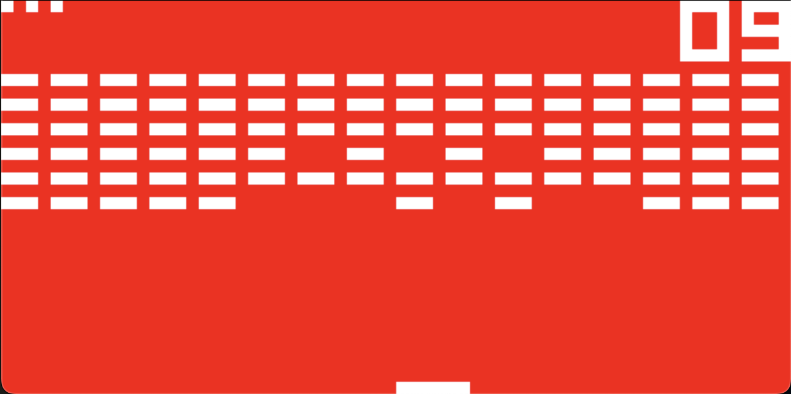

# CHIP-8 Emulator

This is a simple CHIP-8 emulator written in C++. CHIP-8 is an interpreted programming language, developed by Joseph Weisbecker in the 1970s for 8-bit microcomputers. CHIP-8 programs run on a virtual machine that emulates the original hardware, making it easy to play classic games.

[Learn more about CHIP-8 on Wikipedia.](https://en.wikipedia.org/wiki/CHIP-8)

## Screenshots

### INVADERS


### BRIX



## Building

This project uses a Makefile and requires SDL2.

On macOS, you can install SDL2 with Homebrew:
```sh
brew install sdl2
```

On Ubuntu/Linux:
```sh
sudo apt-get install libsdl2-dev
```

To build the emulator, simply run:
```sh
make
```

This will produce an executable named `chip8.elf`.

## Running

You need to provide the path to a ROM file as an argument.  
A collection of CHIP-8 games is provided in the `roms` directory (sourced [Zophar's Domain](https://www.zophar.net/pdroms/chip8/chip-8-games-pack.html)).

For example, to play PONG:
```sh
./chip8.elf roms/INVADERS
```

## Keypad Mapping

The original CHIP-8 had a hexadecimal keypad (0–9, A–F). The key mapping in this emulator is:

| Chip 8 Key | Keyboard Key |
| :--------: | :----------: |
| `1`        | `1`          |
| `2`        | `2`          |
| `3`        | `3`          |
| `4`        | `Q`          |
| `5`        | `W`          |
| `6`        | `E`          |
| `7`        | `A`          |
| `8`        | `S`          |
| `9`        | `D`          |
| `0`        | `X`          |
| `A`        | `Z`          |
| `B`        | `C`          |
| `C`        | `4`          |
| `D`        | `R`          |
| `E`        | `F`          |
| `F`        | `V`          |

The `roms/` directory contains a collection of public domain and open-source CHIP-8 games.  
These ROMs were sourced from [Zophar's Domain](https://www.zophar.net/pdroms/chip8/chip-8-games-pack.html)

## License

This project is licensed under the GNU General Public License v3.0 (GPLv3+).  
See the LICENSE file for the full license text.
